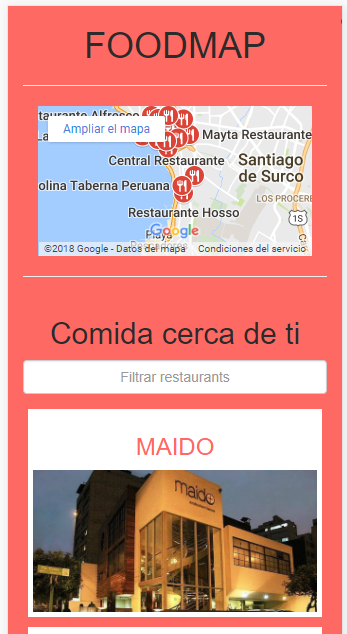

# foodmap

# Sprint 3 Unidad 3 Reto de código: FoodMap

### Contenido:
1. Indicaciones del reto de código
2. Créditos

--------------------------

### 1. Indicaciones del reto de código

1. El resto busca mostra un web para mobile phone en donde se apreciara un listado de restaurantes. Para ello debe ingresar al website.

2. Una vez que el website lo redirecciona a la pagina de búsqueda de restaurantes el podrá observar un listado de locales.

3. El usuario podrá hacer una búsqueda de los restaurantes de su preferencia y ver el detalle de estos.

--------------------------

### 2. Créditos
- Desarrollado por Lourdes Loayza

